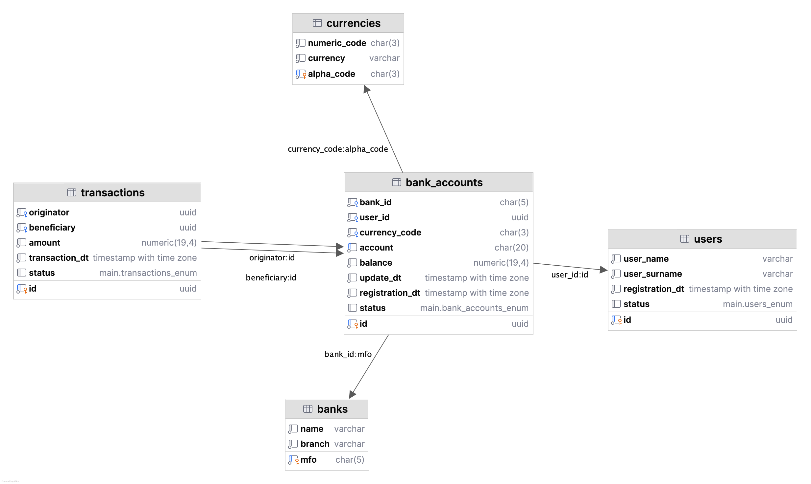

## Payment Processing Change Data Capture Implementation
***
### Introduction:
Imagine a payment processing company, that heavily depends on a transactional database (OLTP), 
say like, PostgreSQL. They process **100,000+ transactions every day** and have 1M+ private clients.

### Problem:
They don't have any other source of truth other than production database, but they want use advanced
analytics, implement machine learning algorithms to learn about their customers and predict their
behavioral patterns.

### Solution:
We create Data WareHouse (DWH) that gets data through Extract-Transform-Load (ETL) pipeline from 
Change Data Capture (CDC) Engine that logs every update in kafka topics. 

**How will Extract-Transform-Load (ETL) pipeline work:** We set up kafka consumer for every table, then
we transform and UPSERT (INSERT+UPDATE) every change that we receive as a message in kafka topics. 

**How does CDC work:** when we update something in a database, it logs that action 
(INSERT, UPDATE, DELETE) in transactions and Debezium Engine catches that change (or delta) and
sends it to a certain kafka topic as a message.

**ETL Pipelines:**
- [Kafka Streams](/implementation-1-kstreams/README.md) (Fastest);
- [Clickhouse Kafka Engine](/implementation-2-clickhouse/README.md) (Average speed, possible overhead);
- [PySpark Consumer](/implementation-3-pyspark/README.md) (Resource intensive, the most flexible).

***

*PostgreSQL Schema:*
